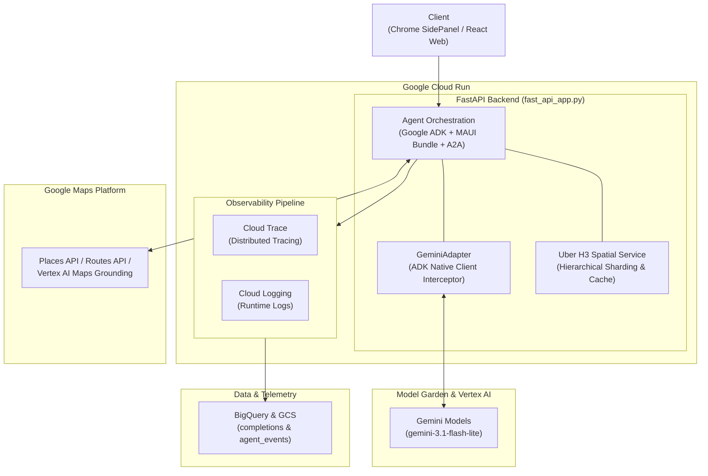

# geo-agent

Built with agents-cli, googlemaps/a2ui, and googlemaps-samples/a2ui:
- **[agents-cli](https://github.com/google/agents-cli)**: The CLI and skills that turn any coding assistant into an expert at creating, evaluating, and deploying AI agents on Google Cloud.
- **[googlemaps/a2ui](https://github.com/googlemaps/a2ui)**: The A2UI implementation for the Maps Agentic UI Toolkit.
- **[googlemaps-samples/a2ui](https://github.com/googlemaps-samples/a2ui)**: Samples for the A2UI implementation for the Maps Agentic UI Toolkit.

Maps Agentic UI (A2UI) agent with Google ADK
Agent generated and updated with `agents-cli` version `1.7.0`

## Project Structure

```
geo-agent/
├── app/                       # Core agent backend (FastAPI & Google ADK)
│   ├── agent.py               # Main agent logic & MAUI bundle definition
│   ├── agent_executor.py      # MAUI agent executor integration
│   ├── fast_api_app.py        # FastAPI Backend server with A2A routes
│   ├── spatial/               # Uber H3 hierarchical spatial indexing & caching
│   │   ├── __init__.py
│   │   └── h3_service.py      # H3 service (lat/lng to cell, k-ring, A2UI enrichment)
│   └── app_utils/             # App utilities, A2A endpoints, and services
├── client/                    # Client applications
│   ├── web/react/             # React web client with A2UI renderer
├── deployment/                # Deployment infrastructure (Terraform)
├── tests/                     # Unit, integration, and evaluation datasets
├── Dockerfile                 # Backend container definition for Cloud Run
├── GEMINI.md                  # AI-assisted development guide
└── pyproject.toml             # Project dependencies and packaging
```

> 💡 **Tip:** Use [Antigravity CLI](https://antigravity.google/) for AI-assisted development - project context is pre-configured in `GEMINI.md`.

## Requirements

Before you begin, ensure you have:
- **uv**: Python package manager (used for all dependency management in this project) - [Install](https://docs.astral.sh/uv/getting-started/installation/) ([add packages](https://docs.astral.sh/uv/concepts/dependencies/) with `uv add <package>`)
- **agents-cli**: Agents CLI - Install with `uv tool install google-agents-cli`
- **Google Cloud SDK**: For GCP services - [Install](https://cloud.google.com/sdk/docs/install)


## Quick Start

Install `agents-cli` and its skills if not already installed:

```bash
uvx google-agents-cli setup
```

Install required packages:

```bash
agents-cli install
```

Test the agent with a local web server:

```bash
agents-cli playground
```

Run code quality


```bash
agents-cli lint
```

You can also use features from the [ADK](https://adk.dev/) CLI with `uv run adk`.

Evaluate agent behavior:

```bash
agents-cli eval run
```

### Agent Configuration & Local Development

#### 1. Configure the Default Agent (`.env`)

Set `A2UI_DEFAULT_AGENT` in `.env` to choose your default agent mode:

```bash
# Option 1: Template Agent (Recommended for low-latency local search & directions)
A2UI_DEFAULT_AGENT=TEMPLATE

# Option 2: Grounding Agent (Vertex AI Maps Grounding)
# A2UI_DEFAULT_AGENT=GROUNDING

# Option 3: Base Agent (Dynamic A2UI component generation via Grounding Lite MCP)
# A2UI_DEFAULT_AGENT=BASE
```

> 💡 **Tip (Per-Query Switching without restart):**
> You can test different agent implementations against the running server by prefixing your prompt:
> * `[GROUNDING] <query>` ➔ Routes directly to `MAUIAgentWithGrounding`
> * `[TEMPLATE] <query>` ➔ Routes directly to `MAUIAgentWithTemplates`
> * `<query>` (no prefix) ➔ Routes to your configured default agent

#### 2. Start the MAUI Agent Backend

```bash
uv run python -m app.fast_api_app
```

#### 3. Start the React Web Client

```bash
cd client/web/react
npm install
npm run dev
```

## 🌐 Uber H3 Spatial Index Inspection API

You can test H3 hexagonal cell indexing and k-ring neighbor lookups using the spatial inspection endpoint:

### 1. Local Development Server
- **Default (Resolution 9):**
  ```bash
  curl "http://localhost:8000/api/spatial/h3-info"
  ```
- **Custom Coordinates & Resolution (e.g., Resolution 8):**
  ```bash
  curl "http://localhost:8000/api/spatial/h3-info?lat=35.6895298&lng=139.7143743&resolution=8"
  ```
- **Interactive Swagger UI:**
  `http://localhost:8000/docs`

### 2. Production (Cloud Run)
- **Endpoint Pattern:**
  ```text
  https://<SERVICE_URL>/api/spatial/h3-info?lat=<LAT>&lng=<LNG>&resolution=<RES>
  ```
- **Interactive Swagger UI:**
  ```text
  https://<SERVICE_URL>/docs
  ```

## Commands

| Command              | Description                                                                                 |
| -------------------- | ------------------------------------------------------------------------------------------- |
| `agents-cli install` | Install dependencies using uv                                                         |
| `agents-cli playground` | Launch local development environment                                                  |
| `agents-cli lint`    | Run code quality checks                                                               |
| `agents-cli eval`    | Evaluate agent behavior (generate, grade, analyze, and more — see `agents-cli eval --help`) |
| `uv run pytest tests/unit tests/integration` | Run unit and integration tests                                                        |
| `agents-cli deploy`  | Deploy agent to Cloud Run                                                                   |
| [A2A Inspector](https://github.com/a2aproject/a2a-inspector) | Launch A2A Protocol Inspector                                                       |

## 🛠️ Project Management

| Command | What It Does |
|---------|--------------|
| `agents-cli scaffold enhance` | Add CI/CD pipelines and Terraform infrastructure |
| `agents-cli infra cicd` | One-command setup of entire CI/CD pipeline + infrastructure |
| `agents-cli scaffold upgrade` | Auto-upgrade to latest version while preserving customizations |

---

## Development

Edit your agent logic in `app/agent.py` and test with `agents-cli playground` - it auto-reloads on save.

## Deployment

#### 1. Configure the Agent Mode for Deployment

By default, Cloud Run automatically inherits `A2UI_DEFAULT_AGENT` from your `.env` file (see [Configure the Default Agent](#1-configure-the-default-agent-env) for available agent modes).

> 💡 **Tip (Overriding Agent Mode at Deploy Time):**
> You can override the agent mode without modifying `.env` using `--update-env-vars`:
> * `agents-cli deploy ... --update-env-vars A2UI_DEFAULT_AGENT=GROUNDING` ➔ Deploy as Grounding Agent
> * `agents-cli deploy ... --update-env-vars A2UI_DEFAULT_AGENT=TEMPLATE` ➔ Deploy as Template Agent

#### 2. Deploy the MAUI Agent Backend (`geo-agent`)

##### 2.1 Set Up Infrastructure (Terraform)

Provision the Google Cloud infrastructure (Cloud Run, GCS telemetry logs bucket, BigQuery dataset/views, and IAM roles) using Terraform via `agents-cli`:

```bash
# Set your GCP project
gcloud config set project <your-project-id>

# 1. Enhance project infrastructure scaffolding (preview -> apply)
agents-cli scaffold enhance --deployment-target cloud_run --bq-analytics --dry-run
agents-cli scaffold enhance --deployment-target cloud_run --bq-analytics

# 2. Provision single-project infrastructure via Terraform (plan preview -> apply)
agents-cli infra single-project --project <your-project-id>
agents-cli infra single-project --apply --project <your-project-id>

# 3. Upgrade project to latest CLI template version (preview -> apply)
agents-cli scaffold upgrade --dry-run
agents-cli scaffold upgrade
```

##### 2.2 Deploy Agent Application

Deploy the application container and code:

```bash
# Deploy using agents-cli (inherits .env settings automatically)
agents-cli deploy --project <your-project-id>
```

##### 2.3 Allow Public Invocation

Allow public invocation (required for client access):

```bash
gcloud run services add-iam-policy-binding geo-agent \
  --region <your-region> \
  --project <your-project-id> \
  --member="allUsers" \
  --role="roles/run.invoker"
```

#### 3. Deploy the React Web Client (`geo-agent-web`)

Deploy the web client to Cloud Run:

```bash
cd client/web/react

gcloud run deploy geo-agent-web \
  --source . \
  --project <your-project-id> \
  --region <your-region> \
  --allow-unauthenticated
```


To add CI/CD and Terraform, run `agents-cli scaffold enhance`.
To set up your production infrastructure, run `agents-cli infra cicd`.

## Observability

Built-in telemetry exports to Cloud Trace, BigQuery, and Cloud Logging.

### 1. Cloud Trace & Prompt-Response Logging (`completions` / `completions_view`)

Prompt-response completions are exported via OpenTelemetry to Cloud Storage and joined with Cloud Logging in BigQuery via the pre-built `completions_view`:

```bash
PROJECT_ID="your-dev-project-id"
PROJECT_NAME="your-project-name"

# Check for telemetry files in GCS
gsutil ls gs://${PROJECT_ID}-${PROJECT_NAME}-logs/completions/

# Query telemetry in BigQuery
bq query --use_legacy_sql=false \
  "SELECT * FROM \`${PROJECT_ID}.${PROJECT_NAME}_telemetry.completions\` LIMIT 10"
```

"Agent interaction turns and deterministic A2UI map payloads (set_model_response) are exported via OpenTelemetry to Cloud Storage and indexed in BigQuery for full auditability:"

```bash
PROJECT_ID="your-dev-project-id"
PROJECT_NAME="your-project-name"
DATASET_NAME="your_project_name_telemetry"  # Note: Use underscores instead of hyphens for BigQuery dataset

# ==============================================================================
# 1. Extract all deterministic A2UI JSON from GCS (Cloud Storage)
# ==============================================================================

# 1.1 List all telemetry log files in GCS
gsutil ls -r "gs://${PROJECT_ID}-${PROJECT_NAME}-logs/completions/**"

# 1.2 Scan and extract all deterministic A2UI JSON payloads (set_model_response) from GCS
FILES=$(gsutil ls -r "gs://${PROJECT_ID}-${PROJECT_NAME}-logs/completions/**" | grep -v ':$' | grep -v 'TOTAL:')
for f in $FILES; do
  gsutil cat "$f" 2>/dev/null | jq -c 'select(.parts[]?.name == "set_model_response") | .parts[] | select(.name == "set_model_response") | .arguments' 2>/dev/null
done | grep '^{' | jq .


# ==============================================================================
# 2. Extract all deterministic A2UI JSON from BigQuery
# ==============================================================================

# Query and display all deterministic A2UI JSON payloads (set_model_response) from BigQuery
bq query --use_legacy_sql=false --location=us-east1 --max_rows=1000 --format=prettyjson \
  "SELECT 
     p.arguments AS a2ui_data 
   FROM \`${PROJECT_ID}.${DATASET_NAME}.completions\`, 
   UNNEST(parts) AS p 
   WHERE p.name = 'set_model_response'"
```


### 2. BigQuery Agent Analytics (`agent_events`)

When `BQ_ANALYTICS_DATASET_ID` is configured, structured ADK agent events, tool calls, and token usage are streamed directly via `BigQueryAgentAnalyticsPlugin`.

#### Example Queries
Replace `YOUR_PROJECT_ID` and `YOUR_AGENT_NAME` accordingly.

Recent events:

```sql
SELECT *
FROM `YOUR_PROJECT_ID.YOUR_AGENT_NAME_telemetry.agent_events`
ORDER BY timestamp DESC
LIMIT 100;
```

Tool calls and errors:

```sql
SELECT
  timestamp,
  JSON_VALUE(content, '$.tool') AS tool_name,
  JSON_VALUE(content, '$.args') AS tool_args,
  status,
  error_message
FROM `YOUR_PROJECT_ID.YOUR_AGENT_NAME_telemetry.agent_events`
WHERE event_type IN ('TOOL_COMPLETED', 'TOOL_ERROR')
ORDER BY timestamp DESC;
```

LLM token usage:

```sql
SELECT
  agent,
  -- Note on ADK schema mismatch:
  -- The upstream documentation specifies '$.model', '$.usage_metadata.prompt', and '$.usage_metadata.completion'.
  -- However, in actual ADK event payloads, these keys are stored as:
  --   '$.model_version' (instead of '$.model')
  --   '$.usage_metadata.prompt_token_count' (instead of '$.usage_metadata.prompt')
  --   '$.usage_metadata.candidates_token_count' (instead of '$.usage_metadata.completion')
  -- If querying against actual ADK agent_events tables, use the token_count keys.
  JSON_VALUE(attributes, '$.model') AS model,
  SUM(CAST(JSON_VALUE(attributes, '$.usage_metadata.prompt') AS INT64)) AS total_prompt_tokens,
  SUM(CAST(JSON_VALUE(attributes, '$.usage_metadata.completion') AS INT64)) AS total_completion_tokens
FROM `YOUR_PROJECT_ID.YOUR_AGENT_NAME_telemetry.agent_events`
WHERE event_type = 'LLM_RESPONSE'
  AND JSON_VALUE(attributes, '$.usage_metadata.prompt') IS NOT NULL
GROUP BY agent, model;
```

## A2A Inspector

This agent supports the [A2A Protocol](https://a2a-protocol.org/). Use the [A2A Inspector](https://github.com/a2aproject/a2a-inspector) to test interoperability.
See the [A2A Inspector docs](https://github.com/a2aproject/a2a-inspector) for details.


## How it works

### Four CLI verbs on rotation

```text
step 1
$ scaffold
spec → 72 files

step 2
$ eval
score before merge

step 3
$ deploy
ship to prod

step 4
$ observe
trace + analytics

↻
scaffold → eval → deploy → observe → repeat
```

scaffold, eval, deploy, observe — on a rotation, forever. You write the spec; the loop catches what would have shipped, ships what passes, and shows you what happens next so the next iteration is smarter.

---

#### How this project utilizes each verb:

* **step 1 · `$ scaffold` (spec → 72 files)**
  * **Scaffolded Foundation**: Generated project structure (`app/`, `deployment/terraform/`, `Dockerfile`, configurations) via `agents-cli` (v1.7.0).
  * **Spec & Configuration**: Managed declaratively in `agents-cli-manifest.yaml` (`deployment_target: cloud_run`, `is_a2a: true`, `base_template: adk`).
  * **Agent Customization**: Extended the baseline ADK agent with Maps Agentic UI (`maui-a2ui-python`, `a2ui-agent-sdk`), A2A protocol routes, and Grounding Lite MCP tools.

* **step 2 · `$ eval` (score before merge)**
  * **Pre-Merge Scoring**: Runs `agents-cli eval run` as an automated quality gate before merging or shipping changes.
  * **Evaluation Datasets**: Leverages evaluation datasets under `tests/eval/` along with `google-cloud-aiplatform[evaluation]` and `google-adk[eval]` to score prompt effectiveness, tool invocation accuracy, and grounding relevance.

* **step 3 · `$ deploy` (ship to prod)**
  * **Container Build**: Packages the application into a production-ready FastAPI / Uvicorn container using `Dockerfile`.
  * **Infrastructure as Code**: Provisions and updates Google Cloud Run, IAM roles, and storage buckets using Terraform definitions in `deployment/terraform/single-project/`.

* **step 4 · `$ observe` (trace + analytics)**
  * **Distributed Trace**: Automatically exports all invocation spans to Cloud Trace via `opentelemetry-resourcedetector-gcp` and `google-adk[otel-gcp]`.
  * **Logging**: Aggregates application logs and GenAI events to Cloud Logging via `google-cloud-logging`.
  * **BigQuery Analytics**: Streams completions, token usage metrics, and tool execution logs to Cloud Storage (`logs_data_bucket`) and BigQuery (`telemetry_dataset`) using `BigQueryAgentAnalyticsPlugin`.

* **↻ `scaffold → eval → deploy → observe → repeat`**
  * **Continuous Improvement Loop**: Production telemetry and query insights from BigQuery feed back into prompt tuning and agent enhancements, verified via `eval` before the next deployment.


## Architecture



The Google Cloud agent stack that `geo-agent` builds on (based on `agents-cli` architecture):

* **Agent Orchestration**
  * **Build with Google's ADK and A2A, with the option to leverage ready to use samples**: Built with `google-adk` for the core agent implementation, `a2a-sdk` for Agent-to-Agent protocol communication, and integrated with the Maps Agentic UI (A2UI) agent bundle.
* **LLMs**
  * **Model Garden**: Uses Gemini foundation models (e.g., `gemini-3-flash-preview`) accessed via Vertex AI / Model Garden.
* **Deployment**
  * **Cloud Run**: Packaged as a FastAPI container application via `Dockerfile` and deployed to Cloud Run (selected over `Agent Runtime` / `GKE`).
* **IaC & CI/CD**
  * **Infrastructure as code**: Provisioned using Terraform manifests under `deployment/terraform/single-project` to automate Cloud Run, IAM, storage, and telemetry datasets.
* **Observability**
  * **OpenTele**: Integrated with `opentelemetry-resourcedetector-gcp` and `google-adk[otel-gcp]` for distributed tracing to Cloud Trace.
  * **Logging**: Uses `google-cloud-logging` to route runtime and inference event logs to Cloud Logging.
* **Data**
  * **Data storage and analysis**: Employs `BigQueryAgentAnalyticsPlugin`, Cloud Storage (`logs_data_bucket`), and BigQuery tables/views for telemetry storage, token tracking, and agent analytics.
* **Evaluation**
  * **Agent Platform Evaluation**: Integrated with `google-cloud-aiplatform[evaluation]` and `google-adk[eval]` test suites under `tests/eval/`.
* **Client**
  * **Client**: Focused frontend client implemented under `client/web/react/` (React Web & Chrome SidePanel) rendering rich Generative UI responses via A2UI.
