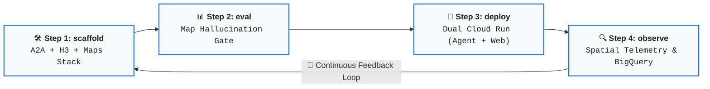
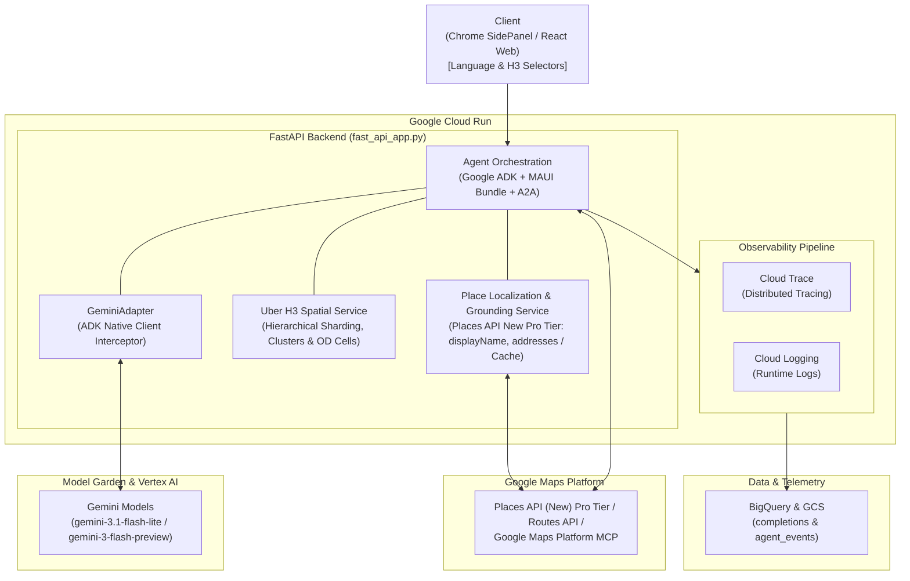

# geo-agent

Built with agents-cli, googlemaps/a2ui, and Google Cloud Agent Stack:
- **[agents-cli](https://github.com/google/agents-cli)**: The CLI and skills that turn any coding assistant into an expert at creating, evaluating, and deploying AI agents on Google Cloud.
- **[googlemaps/a2ui](https://github.com/googlemaps/a2ui)**: The A2UI implementation for the Maps Agentic UI Toolkit.
- **[googlemaps-samples/a2ui](https://github.com/googlemaps-samples/a2ui)**: Samples for the A2UI implementation for the Maps Agentic UI Toolkit.
- **[Uber H3 Spatial Indexing](https://h3geo.org/)**: Discretizes physical geography into hexagonal grid cells (Resolutions 0–15) for deterministic spatial clustering and OD corridor routing.
- **[Google Maps MCP & Places API (New)](https://developers.google.com/maps/ai/grounding-lite)**: Dual-layer grounding combining Grounding Lite MCP for LLM tool search with Places API (New) Pro-tier to eliminate map hallucinations and deliver verified place details.

Maps Agentic UI (A2UI) agent with Google ADK
Agent generated and updated with `agents-cli` version `1.7.0`

## Project Structure

```
geo-agent/
├── app/                       # Core agent backend (FastAPI & Google ADK)
│   ├── agent.py               # Main agent logic & MAUI bundle definition
│   ├── agent_executor.py      # MAUI agent executor integration
│   ├── fast_api_app.py        # FastAPI Backend server with A2A routes
│   ├── localization_service.py # Place localization & Pro-tier metadata service (Places API New)
│   ├── spatial/               # Uber H3 hierarchical spatial indexing & caching
│   │   ├── __init__.py
│   │   └── h3_service.py      # H3 service (lat/lng to cell, k-ring, A2UI enrichment)
│   └── app_utils/             # App utilities, A2A endpoints, and services
├── client/                    # Client applications
│   ├── web/react/             # React web client with A2UI renderer & language selector
├── deployment/                # Deployment infrastructure (Terraform)
├── tests/                     # Unit, integration, and evaluation datasets
├── Dockerfile                 # Backend container definition for Cloud Run
├── GEMINI.md                  # AI-assisted development guide
└── pyproject.toml             # Project dependencies and packaging
```

> 💡 **Tip:** Use [Antigravity CLI](https://antigravity.google/) for AI-assisted development - project context is pre-configured in `GEMINI.md`.

## Requirements

Before you begin, ensure you have:
- **uv**: Python package manager (used for all dependency management in this project) - [Install](https://docs.astral.sh/uv/getting-started/installation/) ([add packages](https://docs.astral.sh/uv/concepts/dependencies/) with `uv add <package>`)
- **agents-cli**: Agents CLI - Install with `uv tool install google-agents-cli`
- **Google Cloud SDK**: For GCP services - [Install](https://cloud.google.com/sdk/docs/install)


## Quick Start

Install `agents-cli` and its skills if not already installed:

```bash
uvx google-agents-cli setup
```

Install required packages:

```bash
agents-cli install
```

Test the agent with a local web server:

```bash
agents-cli playground
```

Run code quality


```bash
agents-cli lint
```

```bash
uv run pytest tests/unit tests/integration
```

You can also use features from the [ADK](https://adk.dev/) CLI with `uv run adk`.

Evaluate agent behavior:

```bash
agents-cli eval run
```

### Agent Configuration & Local Development

#### 1. Configure the Default Agent (`.env`)

Set `A2UI_DEFAULT_AGENT` in `.env` to choose your default agent mode:

```bash
# Option 1: Template Agent (Recommended for low-latency local search & directions)
A2UI_DEFAULT_AGENT=TEMPLATE

# Option 2: Base Agent (Dynamic A2UI component generation via Grounding Lite MCP)
# A2UI_DEFAULT_AGENT=BASE
```

> 💡 **Tip (Dynamic Overrides via Prompt):**
> * `[LANG:ja] <query>` or `[LANG:en] <query>` ➔ Override language resolution dynamically (defaults to UI selector)
> * `[RES:<0-15>] <query>` ➔ Override H3 spatial index resolution (0 to 15)

#### 2. Start the MAUI Agent Backend

```bash
uv run python -m app.fast_api_app
```

#### 3. Start the React Web Client

```bash
cd client/web/react
npm install
npm run dev
```

## Commands

| Command              | Description                                                                                 |
| -------------------- | ------------------------------------------------------------------------------------------- |
| `agents-cli install` | Install dependencies using uv                                                         |
| `agents-cli playground` | Launch local development environment                                                  |
| `agents-cli lint`    | Run code quality checks                                                               |
| `agents-cli eval`    | Evaluate agent behavior (generate, grade, analyze, and more — see `agents-cli eval --help`) |
| `uv run pytest tests/unit tests/integration` | Run unit and integration tests                                                        |
| `agents-cli deploy`  | Deploy agent to Cloud Run                                                                   |
| [A2A Inspector](https://github.com/a2aproject/a2a-inspector) | Launch A2A Protocol Inspector                                                       |

## 🛠️ Project Management

| Command | What It Does |
|---------|--------------|
| `agents-cli scaffold enhance` | Add CI/CD pipelines and Terraform infrastructure |
| `agents-cli infra cicd` | One-command setup of entire CI/CD pipeline + infrastructure |
| `agents-cli scaffold upgrade` | Auto-upgrade to latest version while preserving customizations |

---

## Development

Edit your agent logic in `app/agent.py` and test with `agents-cli playground` - it auto-reloads on save.

## Deployment

#### 1. Deploy the MAUI Agent Backend (`geo-agent`)

##### 1.1 Set Up Infrastructure (Terraform)

Provision the Google Cloud infrastructure (Cloud Run, GCS telemetry logs bucket, BigQuery dataset/views, and IAM roles) using Terraform via `agents-cli`:

```bash
# Set your GCP project
gcloud config set project <your-project-id>

# 1. Enhance project infrastructure scaffolding (preview -> apply)
agents-cli scaffold enhance --deployment-target cloud_run --bq-analytics --dry-run
agents-cli scaffold enhance --deployment-target cloud_run --bq-analytics

# 2. Provision single-project infrastructure via Terraform (plan preview -> apply)
agents-cli infra single-project --project <your-project-id>
agents-cli infra single-project --apply --project <your-project-id>

# 3. Upgrade project to latest CLI template version (preview -> apply)
agents-cli scaffold upgrade --dry-run
agents-cli scaffold upgrade
```

##### 1.2 Deploy Agent Application

Deploy the application container and code:

```bash
# Deploy using agents-cli (inherits .env settings automatically)
agents-cli deploy --project <your-project-id>
```

##### 1.3 Allow Public Invocation

Allow public invocation (required for client access):

```bash
gcloud run services add-iam-policy-binding geo-agent \
  --region <your-region> \
  --project <your-project-id> \
  --member="allUsers" \
  --role="roles/run.invoker"
```

#### 2. Deploy the React Web Client (`geo-agent-web`)

Deploy the web client to Cloud Run:

```bash
cd client/web/react

gcloud run deploy geo-agent-web \
  --source . \
  --project <your-project-id> \
  --region <your-region> \
  --allow-unauthenticated
```


To add CI/CD and Terraform, run `agents-cli scaffold enhance`.
To set up your production infrastructure, run `agents-cli infra cicd`.

## Observability

Built-in telemetry exports to Cloud Trace, BigQuery, and Cloud Logging.

### 1. Cloud Trace & Prompt-Response Logging (`completions` / `completions_view`)

Prompt-response completions are exported via OpenTelemetry to Cloud Storage and joined with Cloud Logging in BigQuery via the pre-built `completions_view`:

```bash
PROJECT_ID="your-dev-project-id"
PROJECT_NAME="your-project-name"

# Check for telemetry files in GCS
gsutil ls gs://${PROJECT_ID}-${PROJECT_NAME}-logs/completions/

# Query telemetry in BigQuery
bq query --use_legacy_sql=false \
  "SELECT * FROM \`${PROJECT_ID}.${PROJECT_NAME}_telemetry.completions\` LIMIT 10"

# Query and display all deterministic A2UI JSON payloads (set_model_response) from BigQuery
bq query --use_legacy_sql=false --location=us-east1 --max_rows=1000 --format=prettyjson \
  "SELECT 
     p.arguments AS a2ui_data 
   FROM \`${PROJECT_ID}.${PROJECT_NAME}_telemetry.completions\`, 
   UNNEST(parts) AS p 
   WHERE p.name = 'set_model_response'"
```


### 2. BigQuery Agent Analytics (`agent_events`)

When `BQ_ANALYTICS_DATASET_ID` is configured, structured ADK agent events, tool calls, and token usage are streamed directly via `BigQueryAgentAnalyticsPlugin`.

#### Example Queries
Replace `YOUR_PROJECT_ID` and `YOUR_AGENT_NAME` accordingly.

Recent events:

```sql
SELECT *
FROM `YOUR_PROJECT_ID.YOUR_AGENT_NAME_telemetry.agent_events`
ORDER BY timestamp DESC
LIMIT 100;
```

Tool calls and errors:

```sql
SELECT
  timestamp,
  JSON_VALUE(content, '$.tool') AS tool_name,
  JSON_VALUE(content, '$.args') AS tool_args,
  status,
  error_message
FROM `YOUR_PROJECT_ID.YOUR_AGENT_NAME_telemetry.agent_events`
WHERE event_type IN ('TOOL_COMPLETED', 'TOOL_ERROR')
ORDER BY timestamp DESC;
```

LLM token usage:

```sql
SELECT
  agent,
  JSON_VALUE(attributes, '$.model') AS model,
  SUM(CAST(JSON_VALUE(attributes, '$.usage_metadata.prompt') AS INT64)) AS total_prompt_tokens,
  SUM(CAST(JSON_VALUE(attributes, '$.usage_metadata.completion') AS INT64)) AS total_completion_tokens
FROM `YOUR_PROJECT_ID.YOUR_AGENT_NAME_telemetry.agent_events`
WHERE event_type = 'LLM_RESPONSE'
  AND JSON_VALUE(attributes, '$.usage_metadata.prompt') IS NOT NULL
GROUP BY agent, model;
```

## A2A Inspector

This agent supports the [A2A Protocol](https://a2a-protocol.org/). Use the [A2A Inspector](https://github.com/a2aproject/a2a-inspector) to test interoperability.
See the [A2A Inspector docs](https://github.com/a2aproject/a2a-inspector) for details.


## How it works

### Four CLI verbs on rotation



In `geo-agent`, the four CLI lifecycle verbs continuously rotate to ensure spatial precision, eliminate map hallucinations, and deliver rich Generative UI:

* **step 1 · `$ scaffold` (Spatial & Maps Agent Foundation)**
  * **A2A & ADK Scaffolding**: Generates the Google ADK foundation, Agent-to-Agent (A2A) protocol routes, and Terraform IaC from the `agents-cli` manifest.
  * **Spatial & Pro-Tier Customization**: Integrates Maps Agentic UI (`maui-a2ui-python`), Uber H3 spatial indexing (`app/spatial/`), and Google Places API (New) Pro-tier grounding (`app/localization_service.py`) directly into the agent pipeline.

* **step 2 · `$ eval` (Map Hallucination Prevention & UI Schema Gate)**
  * **Map Hallucination Prevention**: Automatically verifies that recommended locations, addresses, and route endpoints are factually grounded without spatial or map hallucinations, using bilingual evaluation benchmarks under `tests/eval/`.
  * **A2UI Schema Verification**: Guarantees that generated A2UI JSON structures (map markers, route directions, and place cards) adhere strictly to the Maps UI catalog schemas before shipping.

* **step 3 · `$ deploy` (Production Container & Web Deployment)**
  * **Dual Cloud Run Deployment**: Deploys both the FastAPI agent backend (`geo-agent`) and the React Web / Chrome SidePanel client (`geo-agent-web`) to Google Cloud Run.
  * **Terraform Automation**: Declaratively provisions Cloud Run services, IAM permissions, telemetry storage buckets, and BigQuery datasets.

* **step 4 · `$ observe` (Spatial Telemetry & BigQuery Traces)**
  * **Distributed Tracing**: Visualizes latency across LLM reasoning, Google Maps API queries, and H3 indexing spans via Cloud Trace.
  * **BigQuery Spatial Analytics**: Streams prompt completions, token usage, tool events, and **H3 spatial cell / OD corridor telemetry** to BigQuery via `BigQueryAgentAnalyticsPlugin`.

* **↻ `scaffold → eval → deploy → observe → repeat` (Continuous Feedback from Spatial Data)**
  * Production query insights and spatial distribution telemetry in BigQuery inform prompt refinements, H3 resolution tuning, and template additions, verified by `eval` before every deployment.


## Architecture



The Google Cloud agent stack tailored for `geo-agent`:

* **Agent Orchestration & Protocol**
  * **Google ADK & A2A Integration**: Built on `google-adk` with native Agent-to-Agent (A2A) protocol endpoints and integrated with the Maps Agentic UI (A2UI) runtime bundle (`app/agent.py`, `app/fast_api_app.py`).
* **Uber H3 Spatial Computation**
  * **Hierarchical Grid & Corridor Routing**: Discretizes physical coordinates into hexagonal cells (resolutions 0–15) via `H3SpatialService` for spatial clustering, deterministic spatial sharding, and OD corridor route calculation (`app/spatial/h3_service.py`).
* **Multilingual Place Localization & Grounding**
  * **Places API (New) Pro Tier Interceptor**: Leverages `PlaceLocalizationService` to resolve localized place names (`displayName`), formatted addresses, and live metadata via place IDs, eliminating map hallucinations across all generated A2UI components (`app/localization_service.py`).
* **LLM Engine & Optimization**
  * **GeminiAdapter on Vertex AI**: Uses Gemini models (`gemini-3.1-flash-lite` for high-throughput routing and `gemini-3-flash-preview` for high-reasoning tasks) with token usage tracking piped directly into Google ADK telemetry.
* **Deployment & Containerization**
  * **Dual Cloud Run Services**: Production-grade FastAPI backend (`geo-agent`) and React Web client (`geo-agent-web`) containerized via Docker and hosted on Google Cloud Run.
* **Infrastructure as Code (IaC)**
  * **Terraform**: Declarative provisioning in `deployment/terraform/single-project` managing Cloud Run services, IAM bindings, GCS log buckets, and BigQuery telemetry tables.
* **Full-Stack Observability**
  * **Cloud Trace & Logging**: Distributed tracing via `google-adk[otel-gcp]` and centralized execution logs via `google-cloud-logging`.
* **Telemetry & Spatial Analytics**
  * **BigQuery Agent Analytics**: Real-time streaming of prompt completions, token costs, tool execution events, and H3 spatial metrics via `BigQueryAgentAnalyticsPlugin`.
* **Quality & Evaluation**
  * **Automated Grounding Evaluation**: Bilingual test suites (`tests/eval/`) running via `agents-cli eval` to validate spatial factuality and A2UI schema compliance prior to merging.
* **Frontend Generative UI**
  * **React Web & Chrome SidePanel**: Frontend client in `client/web/react/` using `@googlemaps/a2ui` to render interactive maps, route polylines, and POI cards directly from agent payloads.
